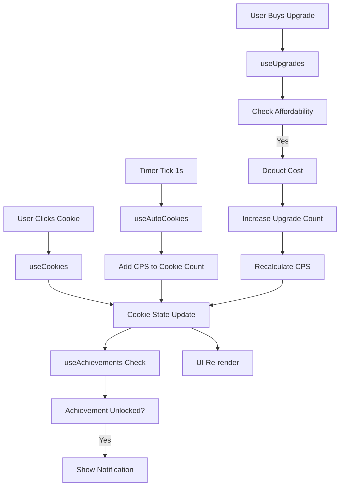
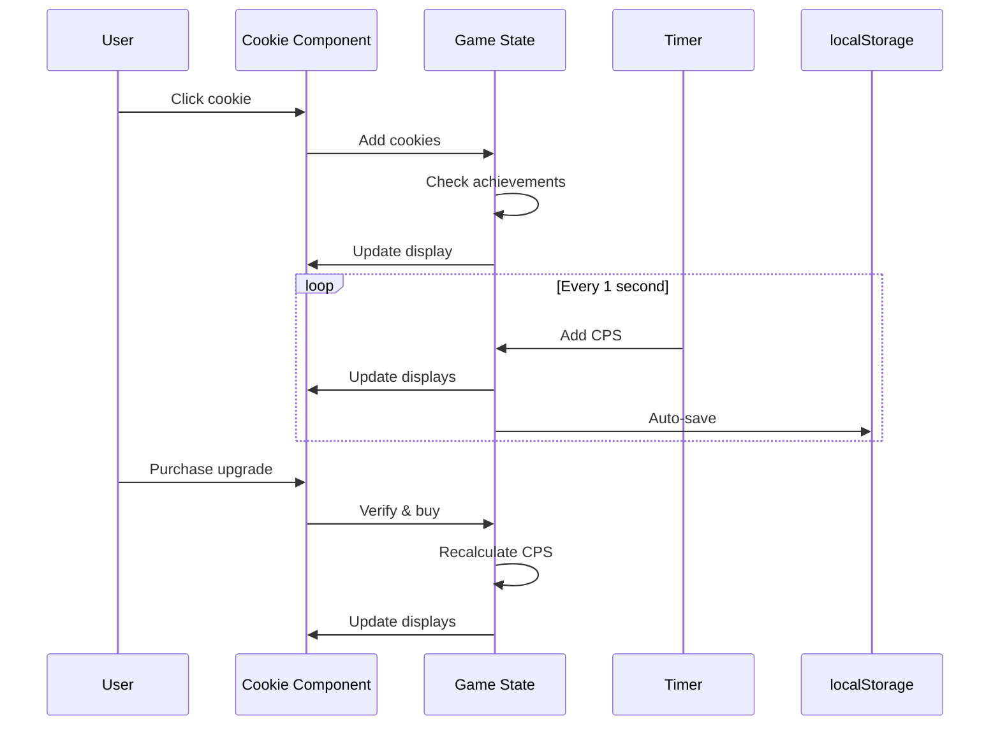

# Cookie Clicker Game - Architecture Plan

## Project Overview
A full-featured Vue 3 cookie clicker game with upgrades, achievements, auto-clickers, and persistent save progress.

## Tech Stack
- **Framework**: Vue 3 (Composition API with `<script setup>`)
- **Build Tool**: Vite
- **State Management**: Vue 3 reactive ref/reactive
- **Persistence**: localStorage

## System Architecture

### Component Structure
```
src/
├── components/
│   ├── CookieClicker.vue          # Main game container
│   ├── CookieButton.vue           # Clickable cookie component
│   ├── StatsPanel.vue             # Game statistics display
│   ├── UpgradesShop.vue           # Upgrades purchase interface
│   ├── AchievementsPanel.vue      # Achievements display
│   └── GameControls.vue           # Save/Reset buttons
├── composables/
│   ├── useGameState.js            # Game state management
│   ├── useCookies.js              # Cookie logic
│   ├── useUpgrades.js             # Upgrade system
│   ├── useAchievements.js         # Achievement tracking
│   └── usePersistence.js          # Save/Load system
└── utils/
    ├── upgradeConfig.js           # Upgrade definitions
    └── achievementConfig.js       # Achievement definitions
```

## Core Game Systems

### 1. Game State Management (`useGameState.js`)
**Responsibilities**: Central state for entire game
```javascript
Reactive state:
- cookieCount: Number (current cookies)
- cookiesPerSecond: Number (CPS)
- totalCookiesEarned: Number (lifetime)
- totalClicks: Number (lifetime clicks)
- playTime: Number (seconds played)
- upgrades: Array (owned upgrade quantities)
- achievements: Array (unlocked achievements)
- isGameRunning: Boolean
```

### 2. Cookie System (`useCookies.js`)
**Responsibilities**: Handle cookie generation and click effects
- Manual cookie clicking (base: 1 cookie per click)
- Auto-cookie generation (CPS from upgrades)
- Visual feedback (particle effects, animations)
- Click power modifiers (from upgrades)

### 3. Upgrade System (`useUpgrades.js`)
**Responsibilities**: Manage upgrade purchasing and effects
```javascript
Upgrade Definition Structure:
{
  id: "cursor",
  name: "Cursor",
  description: "Auto-clicks once every 10 seconds",
  baseCost: 15,
  cps: 0.1,
  icon: "👆"
}
```

**Cost Scaling Formula**:
```
cost = baseCost × (1.15 ^ quantity)
```

**Planned Upgrades**:
1. Cursor (0.1 CPS) - Auto-clicks
2. Grandma (1 CPS) - Bakes cookies
3. Farm (8 CPS) - Grows cookie ingredients
4. Mine (47 CPS) - Mines cookie dough
5. Factory (260 CPS) - Mass produces cookies

### 4. Achievement System (`useAchievements.js`)
**Responsibilities**: Track and unlock achievements
```javascript
Achievement Definition Structure:
{
  id: "first_click",
  name: "First Steps",
  description: "Click the cookie once",
  condition: (state) => state.totalClicks >= 1,
  icon: "🏆"
}
```

**Planned Achievements**:
1. First Steps (1 click)
2. Cookie Rookie (100 clicks)
3. Click Master (1,000 clicks)
4. Cookie Collector (1,000 total cookies)
5. Wealthy Baker (1,000,000 total cookies)
6. Upgrade Beginner (buy first upgrade)
7. Upgrade Master (own 50 total upgrades)
8. Production Power (reach 10 CPS)
9. Cookie Empire (reach 100 CPS)

### 5. Persistence System (`usePersistence.js`)
**Responsibilities**: Save/load game progress
- Save game state to localStorage
- Load game state on app mount
- Auto-save every 30 seconds
- Handle save slots (optional)

**Save Structure**:
```javascript
{
  cookieCount,
  cookiesPerSecond,
  totalCookiesEarned,
  totalClicks,
  playTime,
  upgrades: { cursor: 5, grandma: 2, ... },
  unlockedAchievementIds: [...],
  timestamp
}
```

## Data Flow Diagram



## Game Loop



## UI Layout Design

```
┌─────────────────────────────────────────────────────┐
│              Cookie Clicker                         │
├──────────────────────┬──────────────────────────────┤
│                      │   Stats Panel                 │
│                      │   ┌────────────────┐         │
│                      │   │ Cookies: 1,234 │         │
│                      │   │ CPS: 5.6       │         │
│   🍪                │   │ Clicks: 500    │         │
│   [BIG COOKIE]      │   └────────────────┘         │
│                      │                              │
│                      │   Upgrades Shop             │
│                      │   ┌────────────────┐         │
│                      │   │ 👆 Cursor x3   │         │
│                      │   │ Cost: 150      │         │
│                      │   └────────────────┘         │
│                      │   ┌────────────────┐         │
│                      │   │ 👵 Grandma x1  │         │
│                      │   │ Cost: 100      │         │
│                      │   └────────────────┘         │
│                      │                              │
├──────────────────────┴──────────────────────────────┤
│ Achievements            │  [Reset]  [Save]          │
│ 🏆 First Steps          │                            │
│ 🏆 Cookie Rookie        │                            │
└─────────────────────────────────────────────────────┘
```

## Key Technical Decisions

### 1. State Management
- Use Vue 3 Composition API with `ref()` and `reactive()`
- Centralized state in composables for reusability
- Computed properties for derived values (CPS, upgrade costs)

### 2. Auto-Clicker Implementation
- `setInterval` running every 100ms (10 ticks per second)
- Each tick adds: `cookiesPerSecond / 10`
- Smoother visual updates compared to 1-second intervals

### 3. Save/Load Strategy
- Auto-save every 30 seconds
- Save on browser close (beforeunload event)
- Save game state as JSON in localStorage
- Version field for future migrations

### 4. Achievement Checking
- Check achievements after every cookie count change
- Use Set for efficient achievement ID lookups
- Show toast notification on unlock

### 5. Performance Considerations
- debounce expensive calculations
- Use CSS animations for visual feedback (lighter than JS)
- Limit particle effects to prevent UI lag
- Lazy load achievements panel (only shown when needed)

## Extension Points

Future features that can be added:
1. Golden cookies (random bonus events)
2. Prestige system (reset for multipliers)
3. Seasonal themes
4. Leaderboard/online features
5. Sound effects and music
6. Mini-games within upgrades
7. Cookie visual customization

## Testing Checklist

- [ ] Cookie click adds correct amount
- [ ] Auto-clicks works correctly
- [ ] Upgrades cost scales properly
- [ ] Cannot buy unaffordable upgrades
- [ ] Achievements unlock at correct thresholds
- [ ] Save/load persists all data
- [ ] Reset clears all data
- [ ] UI responsive on mobile
- [ ] No memory leaks (intervals cleaned up)
- [ ] Achievement notifications show correctly